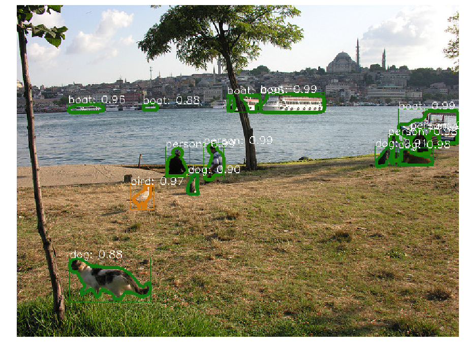

# Mask RCNN

This repository based on [mask-rcnn benchmark](https://github.com/facebookresearch/maskrcnn-benchmark), 

## Getting Started

These instructions will show you how to run pretrained Mask-RCNN on COCO data set and train a new custom object, step by step

<center>
   
</center>

---

## Prerequisites

What things you need to run this codes:
1. anaconda distribution --> [Download](https://repo.anaconda.com/archive/Anaconda3-2019.10-Linux-x86_64.sh)


Tested on MSI-GP63 (Leopard 8RE):

1. 8th Gen. Intel® Core™ i7 processor
2. GTX 1060 6GB GDDR5 with desktop level performance
3. Memory 16GB DDR4 2666MHz
4. SSD 256 GB
5. Ubuntu 16.04.06 LTS (with ROS Kinetic)
6. Logitech C922, C930E webcam


---
## Table of Contents

[TOC]

---

### Step 1 (Conda environment)

Create new conda environment with name ***MaskRCNN***
```
conda create -n MaskRCNN python=3.7 pip
```

Install the environment packages

```
conda activate MaskRCNN
cd MaskRCNN
touch requirements.txt # copy all following packages name in below
pip install -r requirements.txt
```

requirements.txt :
```
numpy
scipy
Pillow
cython
matplotlib
scikit-image
tensorflow>=1.3.0
keras>=2.0.8
opencv-python
h5py
imgaug
IPython[all]
ninja
yacs
cython
matplotlib
tqdm
```

---

### Step 2 (Install packages)

```
export INSTALL_DIR=MaskRCNN/

# install pycocotools
cd $INSTALL_DIR
git clone https://github.com/cocodataset/cocoapi.git
cd cocoapi/PythonAPI
python setup.py build_ext install

# install cityscapesScripts
cd $INSTALL_DIR
git clone https://github.com/mcordts/cityscapesScripts.git
cd cityscapesScripts/
python setup.py build_ext install

# install apex
cd $INSTALL_DIR
git clone https://github.com/NVIDIA/apex.git
cd apex
python setup.py install --cuda_ext --cpp_ext

# re-build it
cd $INSTALL_DIR
python setup.py build develop
```

---

### Step 3 (Labeling)
Reference [repository](https://github.com/wkentaro/labelme) for labeling new data.

**Installation:**
```
sudo apt-get install python3-pyqt5
pip install labelme
```

**Commands:**
```
mkdir datasets/coco
cd datasets/coco
```

**COCO dataset:**
```
wget http://images.cocodataset.org/zips/train2014.zip
wget http://images.cocodataset.org/zips/val2014.zip
wget http://images.cocodataset.org/annotations/annotations_trainval2014.zip
unzip train2014.zip -d train2014/
unzip val2014.zip -d val2014/
unzip annotations_trainval2014.zip -d annotations/
```

**Custom dataset:**
Download from google drive [link](https://drive.google.com/open?id=1fwDWYjVyal0pbiu-3kLnQsv9pVe0hSjc), and then move the folder into `MaskRCNN/datasets/coco/`


**Running:**  

<center>
   
</center>

```
labelme
# then open directory pointing to custom dataset
```


---

### Step 4 (Converting to COCO format)
Reference [repository](https://github.com/Tony607/labelme2coco) for converting to COCO format.

Default running:
```
cd MaskRCNN/
git clone https://github.com/Tony607/labelme2coco.git
cp labelme2coco/labelme2coco.py datasets/coco/
cd datasets/coco/
python labelme2coco.py folder_name/ --output "captions_name.json"
```

example:
```
python labelme2coco.py robot_images/ --output "captions_train_wolf.json"
python labelme2coco.py tripod_images/ --output "captions_val_wolf.json"
```

---

### Step 5 (Training)

**1. Running tensorboard on terminal 1:**

```
conda activate MaskRCNN
cd MaskRCNN
mkdir runs
tensorboard --logdir=runs
```

**2. Start training on terminal 2:**
```
cd MaskRCNN/
python tools/train_net.py --config-file "configs/e2e_mask_rcnn_R_50_FPN_wolf.yaml"
```

<center>
   
</center>

**Note:**
Training will save checkpoint every 2500 iterations at OUTPUT_DIR: `MaskRCNN/log/`
Change hyperparameter configuration `MaskRCNN/configs/e2e_mask_rcnn_R_50_FPN_wolf.yaml`:

```
MODEL:
  META_ARCHITECTURE: "GeneralizedRCNN"
  WEIGHT: "catalog://ImageNetPretrained/MSRA/R-50"
  # WEIGHT: "../log/model_0002500.pth"
  # WEIGHT: "~/.torch/models/R-50.pkl"
  BACKBONE:
    CONV_BODY: "R-50-FPN"
  RESNETS:
    BACKBONE_OUT_CHANNELS: 256
  RPN:
    USE_FPN: True
    ANCHOR_STRIDE: (4, 8, 16, 32, 64)
    PRE_NMS_TOP_N_TRAIN: 2000
    PRE_NMS_TOP_N_TEST: 1000
    POST_NMS_TOP_N_TEST: 1000
    FPN_POST_NMS_TOP_N_TEST: 1000
  ROI_HEADS:
    USE_FPN: True
  ROI_BOX_HEAD:
    POOLER_RESOLUTION: 7
    POOLER_SCALES: (0.25, 0.125, 0.0625, 0.03125)
    POOLER_SAMPLING_RATIO: 2
    FEATURE_EXTRACTOR: "FPN2MLPFeatureExtractor"
    PREDICTOR: "FPNPredictor"
  ROI_MASK_HEAD:
    POOLER_SCALES: (0.25, 0.125, 0.0625, 0.03125)
    FEATURE_EXTRACTOR: "MaskRCNNFPNFeatureExtractor"
    PREDICTOR: "MaskRCNNC4Predictor"
    POOLER_RESOLUTION: 14
    POOLER_SAMPLING_RATIO: 2
    RESOLUTION: 28
    SHARE_BOX_FEATURE_EXTRACTOR: False
  MASK_ON: True
DATASETS:
  # TRAIN: ("coco_2014_train",)
  TRAIN: ("coco_wolf_train",)
  # TEST: ("coco_2014_val",)
  TEST: ("coco_wolf_val",)
DATALOADER:
  SIZE_DIVISIBILITY: 32
SOLVER:
  IMS_PER_BATCH: 2 # number of images per batch
  BASE_LR: 0.02 # 0.0025
  WEIGHT_DECAY: 0.0001
  STEPS: (60000, 80000) # (480000, 640000)
  MAX_ITER: 90000 # 720000
OUTPUT_DIR: "log"

```

---

### Step 6 (Testing)

**COCO dataset**
```
cd MaskRCNN
cd demo
python webcam.py
```

**Custom dataset**
```
cd MaskRCNN
cd demo
python video.py
```

---

References
---
All credit goes to following repository:
1. https://www.anaconda.com/distribution/#download-section
2. https://github.com/facebookresearch/maskrcnn-benchmark
3. https://github.com/wkentaro/labelme
4. https://github.com/Tony607/labelme2coco

---
## Appendix and FAQ

:::info
**Find this document incomplete?** Leave a comment!
:::
